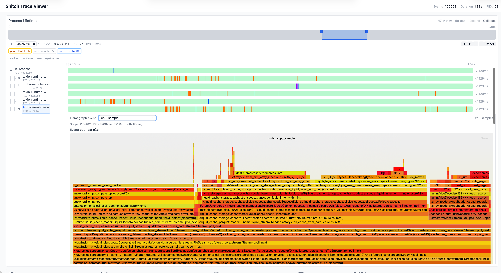

# probex

`probex` is a low-friction Linux profiler.
It runs a command, collects everything you need, and visualizes it.

## Usage

### Nix
```
nix run github:XiangpengHao/probex -- sleep 1
```

### Cargo

```shell
cargo install probex
sudo probex -- sleep 1
```

Or build from source:
```shell
cargo build --release -p probex --locked
sudo target/release/probex -- sleep 1
```

### Download binary

```shell
wget https://github.com/XiangpengHao/probex/releases/download/latest/probex-linux-x86_64-latest.tar.gz
tar -xzf probex-linux-x86_64-latest.tar.gz
sudo ./probex-linux-x86_64-latest/probex -- sleep 1
```

## What it looks like



#### Frame pointers

`probex` works best with frame pointers enabled on the target binary.
Without them, stack traces may be shallow or incomplete.
[Why you should enable them](https://www.brendangregg.com/blog/2024-03-17/the-return-of-the-frame-pointers.html).

Rust — add to `.cargo/config.toml`:
```toml
[build]
rustflags = ["-C", "force-frame-pointers=yes"]
```

C / C++ — compile with `-fno-omit-frame-pointer`.

## Contributing

### 1. Prerequisites

1. Stable Rust: `rustup toolchain install stable`
2. Nightly + `rust-src` (needed for eBPF build): `rustup toolchain install nightly --component rust-src`
3. `bpf-linker`: `cargo install bpf-linker` (`--no-default-features` on macOS)

You need Linux with eBPF tracepoint support and sufficient privileges (typically root).

### 2. Trace a command

First build the probex-viewer app:
```shell
dx bundle --release --fullstack -p probex-viewer
```

Then run probex to collect events.
```shell
sudo -E cargo run --release -p probex -- -- sleep 1
```

Nix one-command flow (builds missing artifacts, traces, then opens viewer):
```shell
nix run .#probex -- sleep 1
```

Default behavior:

1. Writes `trace.parquet`
2. If events were captured, launches `probex-viewer` on port `8080`
3. If `probex-viewer` is missing (or not bundled correctly), tracing still succeeds and `probex` logs a warning instead of launching the viewer

### 3. Common CLI examples

Custom output path:

```shell
sudo -E cargo run --release -p probex -- -o /tmp/my-trace.parquet -- sleep 2
```

Do not auto-launch viewer:

```shell
sudo -E cargo run --release -p probex -- --no-viewer -- sleep 2
```

Enable perf-style CPU sampling at 99 Hz:

```shell
sudo -E cargo run --release -p probex -- --sample-freq 99 -- sleep 5
```

For deep user-space call stacks, build traced binaries with frame pointers
enabled (for Rust: `RUSTFLAGS="-C force-frame-pointers=yes"`), otherwise
stack traces may appear shallow or noisy.

Change viewer port used by auto-launch:

```shell
sudo -E cargo run --release -p probex -- --port 9000 -- sleep 2
```

## Viewer Guide

For local fullstack development in this repo, use the Dioxus dev server:

```shell
dx serve -p probex-viewer
```

The server reads `PROBEX_FILE` (default: `trace.parquet`), so set `PROBEX_FILE=/path/to/trace.parquet` when needed.

Then open `http://localhost:8080`.

For production/distribution of the fullstack app, build a Dioxus bundle:

```shell
dx bundle --release --platform server --fullstack -p probex-viewer
```

The bundled server binary is typically produced under:

```shell
target/dx/probex-viewer/release/web/probex-viewer
```

You can also control output location:

```shell
dx bundle --release --platform server --fullstack -p probex-viewer --out-dir ./dist
```

Then run the bundled executable and pass runtime args:

```shell
./dist/web/probex-viewer --file trace.parquet --port 8080 --address 0.0.0.0
```

Viewer features:

1. Event table with pagination
2. Filter by event type
3. Filter by PID
4. Summary stats: total events, distinct event types/PIDs, trace duration

## Current Limitations

1. Linux-only (tracepoint/eBPF based).
2. `process_exit.exit_code` is currently `0` because that tracepoint does not provide exit status directly in this implementation.
3. `sched_switch` does not include real TGIDs for prev/next tasks (stored as `0`).
4. Only read/write syscalls are traced right now.

## Development

Regular checks:

```shell
cargo check
```

Integration tests that require root + eBPF support:

```shell
sudo -E cargo test --package probex --test integration_test
```

## License

With the exception of eBPF code, probex is distributed under the terms
of either the [MIT license] or the [Apache License] (version 2.0), at your
option.

Unless you explicitly state otherwise, any contribution intentionally submitted
for inclusion in this crate by you, as defined in the Apache-2.0 license, shall
be dual licensed as above, without any additional terms or conditions.

### eBPF

All eBPF code is distributed under either the terms of the
[GNU General Public License, Version 2] or the [MIT license], at your
option.

Unless you explicitly state otherwise, any contribution intentionally submitted
for inclusion in this project by you, as defined in the GPL-2 license, shall be
dual licensed as above, without any additional terms or conditions.

[Apache license]: LICENSE-APACHE
[MIT license]: LICENSE-MIT
[GNU General Public License, Version 2]: LICENSE-GPL2
